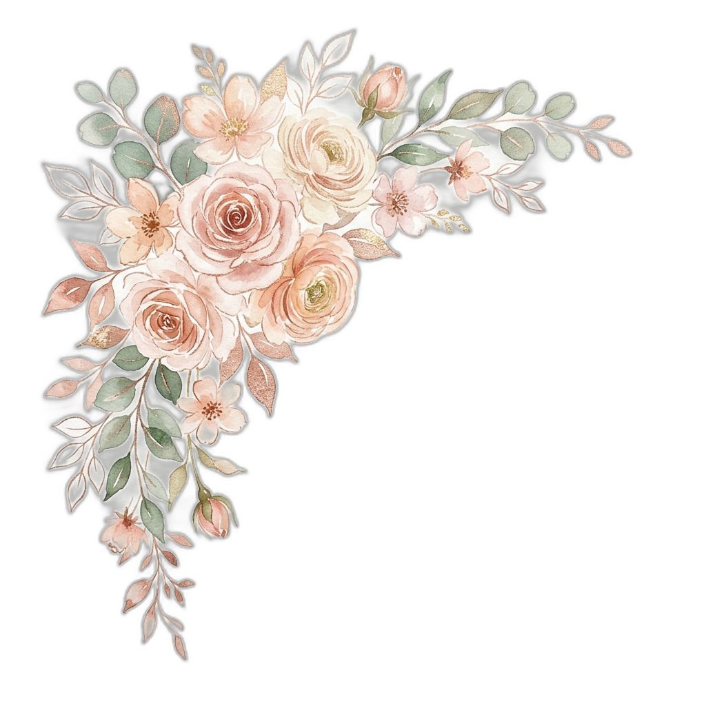
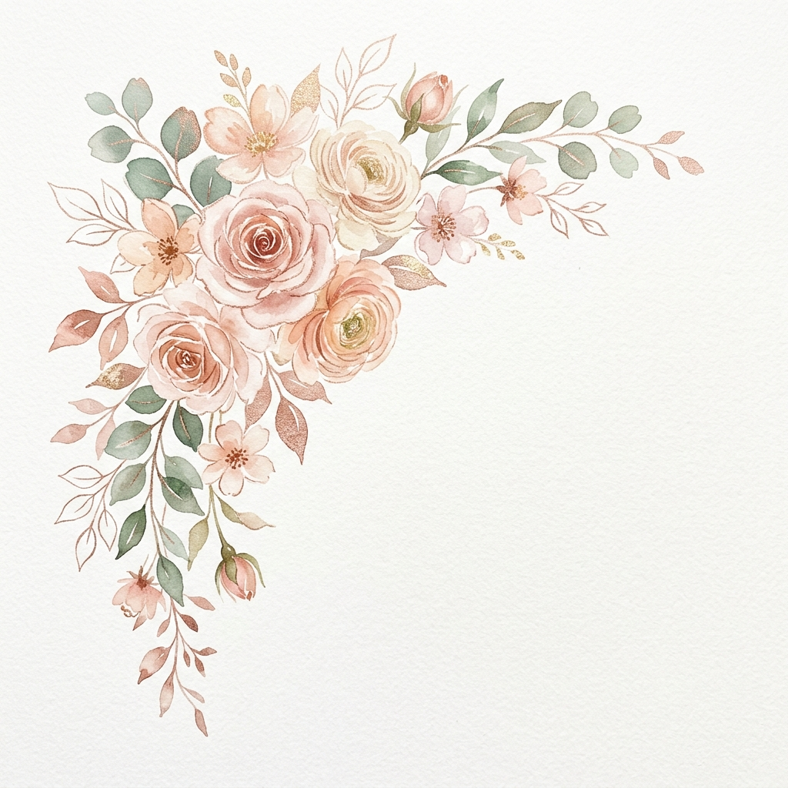

# Changelog: Correção de Recorte e Posicionamento (Reasoning Design)

**Data:** 19/05/2026
**Hora:** 14:50

## Motivação
**Prompt:** "Não tá ficando bom essas flores que tu escolheu. O recorte tá mal feito (tá com um contorno escuro), o posicionamento delas tá horrível."

## Explicação (Reasoning Design Protocol)
1. **Remoção do Halo Escuro (Alpha Matting Issue):** As imagens PNG geradas com IA e recortadas localmente pela ferramenta `rembg` sofriam de contorno escuro devido à complexidade da técnica de aquarela (pixels semitransparentes). A solução definitiva adotada foi substituir as imagens recortadas pela imagem **raw** (bruta, com fundo branco) e aplicar a propriedade CSS avançada `mix-blend-mode: multiply;`. Com o fundo da página sendo esbranquiçado, o CSS "apaga" perfeitamente o branco da imagem de forma algorítmica, mesclando as cores sobre a página sem qualquer artefato de recorte.
2. **Correção Espacial (White Space):** As imagens estavam posicionadas intrusivamente, atropelando os textos (ex: "Querida Madrinha"). Para preservar a hierarquia visual (o texto importa mais), reduzi o tamanho máximo (`max-width: 180px`), aumentei a transparência base (`opacity: 0.85`), e afastei as coordenadas das laterais (de `left: -20px` para `left: -60px`), fazendo com que as flores apenas "espiem" pelas margens do convite de modo sutil e elegante.

## Código Antigo (Trecho)
`index.html`:
```html

```
`styles.css`:
```css
.floral {
    position: absolute;
    z-index: 5;
    opacity: 0.95;
    max-width: 250px;
}
.floral-1 { left: -20px; }
```

## Código Novo (Trecho)
`index.html`:
```html

```
`styles.css`:
```css
.floral {
    position: absolute;
    z-index: 5;
    opacity: 0.85;
    max-width: 180px;
    mix-blend-mode: multiply;
}
.floral-1 { left: -60px; }
```
