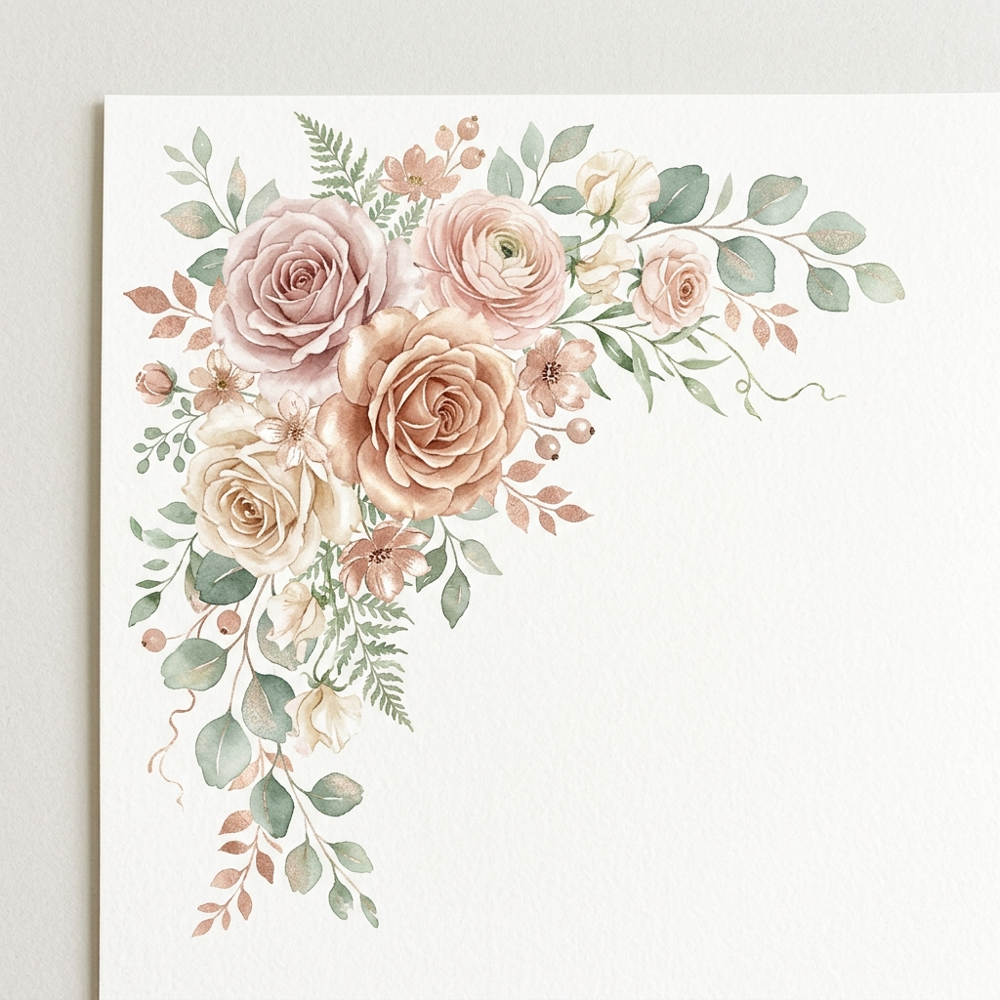

# Changelog: Curadoria de Assets Florais Orgânicos

**Data:** 19/05/2026
**Hora:** 15:02

## Motivação
**Prompt:** "Você só tá reconfigurando a mesma imagem. Se tu analisar a base que te mandei, vai ver que são flores diferentes, ramos em formatos adequados a posição que vão ocupar."
O usuário notou (corretamente) que eu havia espelhado e reutilizado o mesmo PNG (asset `flower_raw.png`) com `transform: scale(-1)` via CSS nas quatro posições, destruindo a naturalidade de um convite pintado à mão, onde os arranjos do topo são largos e as laterais são esguias.

## Explicação
De acordo com o *Reasoning Design Protocol* aprovado, executei a substituição do asset único por **quatro novos arquivos distintos**, gerados independentemente por IA para preencher as exigências espaciais anatômicas da página:
1. `flower_header.png`: Arranjo volumoso de topo esquerdo.
2. `flower_side_right.png`: Feixe delicado lateral para o meio da direita.
3. `flower_side_left.png`: Cacho de folhas solto para a esquerda.
4. `flower_footer.png`: Arranjo farto para selar o canto inferior direito.

As amarras de `transform` no CSS foram removidas.

## Código Novo (Trecho HTML e CSS)
`index.html`:
```html
<header class="section section-relative">
    
```
`styles.css`:
```css
.floral-header { top: -20px; left: -40px; max-width: 200px; }
.floral-side-right { top: 20px; right: -40px; max-width: 140px; }
```
