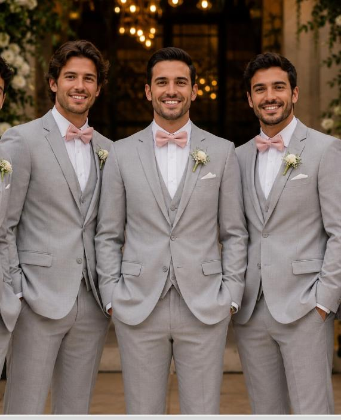

# Changelog [22/05/2026 - 03:10] - Atualização de Imagens dos Padrinhos e Madrinhas

Este changelog documenta a substituição da imagem de inspiração dos padrinhos pelo arquivo fornecido pelo usuário e a adição de um bloco de inspiração na seção das madrinhas.

## Prompt Motivador
1. "Terno do padrinho cinza liso, altera a imagem"
2. "Essa imagem para mostrar o tom do vestido das madrinhas"

## Funcionamento Anterior vs. Funcionamento Atual
- **Antes:**
  - A seção de padrinhos utilizava um link externo de imagem do Unsplash como placeholder para a inspiração de terno.
  - A seção de madrinhas continha apenas a paleta de cores em círculos CSS, sem nenhuma imagem de inspiração.
- **Agora:**
  - A seção de padrinhos aponta para o asset local `assets/processed/terno_padrinho.png`, exibindo os padrinhos reais com terno cinza liso e gravata borboleta rosa/salmão.
  - A seção de madrinhas agora tem um bloco correspondente de "Inspire-se" com a imagem local `assets/processed/vestido_madrinha.png` mostrando o tom do vestido das madrinhas.

## Backups Criados
- `index_backup_9_20260522.html` (criado antes da modificação em `index.html`)
- `styles_backup_8_20260522.css` (criado como cópia de segurança preventiva de `styles.css`)

## Código Antigo vs. Código Novo (Diferenças em `index.html`)

### Código Antigo:
```html
        <!-- Godmother Section -->
        <section class="section godparents-section section-relative">
            
            
            <h2 class="cursive-title">Querida Madrinha</h2>
            <p class="description">
                Queremos que nesse dia você se sinta linda<br>
                e confortável, escolha um modelo de vestido<br>
                longo de sua preferência e fique à vontade<br>
                para optar por algum dos tons abaixo.
            </p>
            <div class="color-palette">
                <div class="color-swatch" style="background-color: #f2e3e5;"></div>
                <div class="color-swatch" style="background-color: #e6c5c8;"></div>
                <div class="color-swatch" style="background-color: #d19ba0;"></div>
                <div class="color-swatch" style="background-color: #b76e79;"></div>
                <div class="color-swatch" style="background-color: #944b55;"></div>
            </div>
        </section>

        <!-- Godfather Section -->
        <section class="section godparents-section">
            <h2 class="cursive-title">Querido Padrinho</h2>
            <p class="description">
                Queremos que você se sinta elegante e<br>
                confortável, nada mais elegante que um belo<br>
                terno cinza, camisa branca e a cor da gravata<br>
                combinando com o vestido da madrinha.
            </p>
            <h3 class="inspire-title">Inspire-se</h3>
            <div class="inspire-image">
                <!-- Suit inspiration image placeholder -->
                
            </div>
        </section>
```

### Código Novo:
```html
        <!-- Godmother Section -->
        <section class="section godparents-section section-relative">
            
            
            <h2 class="cursive-title">Querida Madrinha</h2>
            <p class="description">
                Queremos que nesse dia você se sinta linda<br>
                e confortável, escolha um modelo de vestido<br>
                longo de sua preferência e fique à vontade<br>
                para optar por algum dos tons abaixo.
            </p>
            <div class="color-palette">
                <div class="color-swatch" style="background-color: #f2e3e5;"></div>
                <div class="color-swatch" style="background-color: #e6c5c8;"></div>
                <div class="color-swatch" style="background-color: #d19ba0;"></div>
                <div class="color-swatch" style="background-color: #b76e79;"></div>
                <div class="color-swatch" style="background-color: #944b55;"></div>
            </div>
            <h3 class="inspire-title">Inspire-se</h3>
            <div class="inspire-image">
                
            </div>
        </section>

        <!-- Godfather Section -->
        <section class="section godparents-section">
            <h2 class="cursive-title">Querido Padrinho</h2>
            <p class="description">
                Queremos que você se sinta elegante e<br>
                confortável, nada mais elegante que um belo<br>
                terno cinza, camisa branca e a cor da gravata<br>
                combinando com o vestido da madrinha.
            </p>
            <h3 class="inspire-title">Inspire-se</h3>
            <div class="inspire-image">
                
            </div>
        </section>
```
