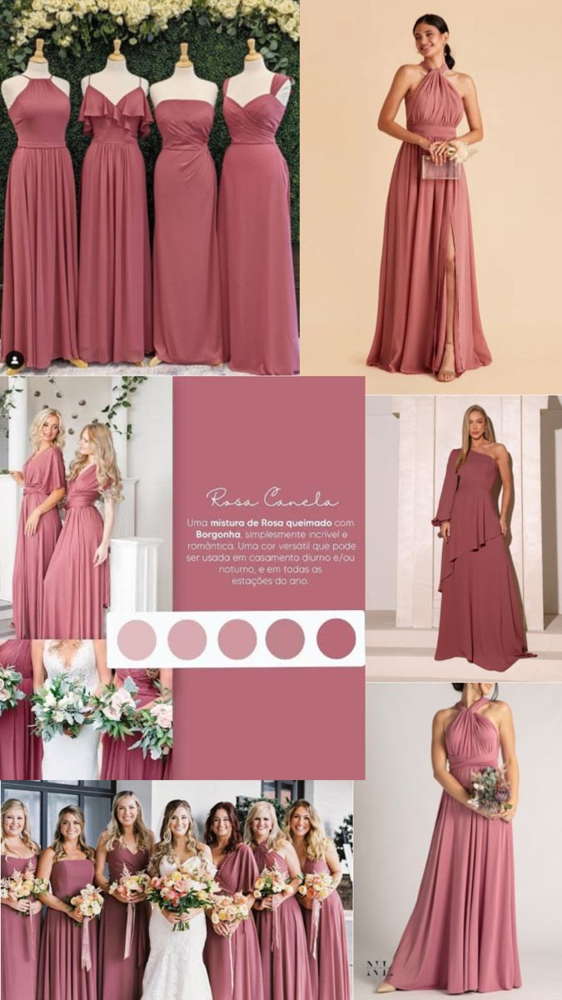

# Changelog [22/05/2026 - 16:50] - Imagem da Madrinha Tom do Vestido

Este changelog documenta a substituição do placeholder transparente pela imagem de inspiração real do tom de vestido das madrinhas.

## Prompt Motivador
"A imagem para madrinhas não tá aparecendo. Pega essaa: Downloads/baixados (7).jpg"

## Funcionamento Anterior vs. Funcionamento Atual
- **Antes:**
  - O bloco de inspiração da seção de madrinhas apontava para o arquivo `assets/processed/vestido_madrinha.png`, que era um placeholder completamente transparente enviado no turno anterior.
- **Agora:**
  - A imagem foi substituída pela foto real fornecida no diretório de downloads do usuário (`Downloads/baixados (7).jpg`).
  - O arquivo foi copiado para `assets/processed/vestido_madrinha.jpg` e o código HTML foi atualizado para apontar para a nova imagem com a extensão correta `.jpg`.

## Backups Criados
- `index_backup_10_20260522.html` (criado antes de modificar `index.html`)

## Código Antigo vs. Código Novo (Diferenças em `index.html`)

### Código Antigo:
```html
            <h3 class="inspire-title">Inspire-se</h3>
            <div class="inspire-image">
                
            </div>
```

### Código Novo:
```html
            <h3 class="inspire-title">Inspire-se</h3>
            <div class="inspire-image">
                
            </div>
```
