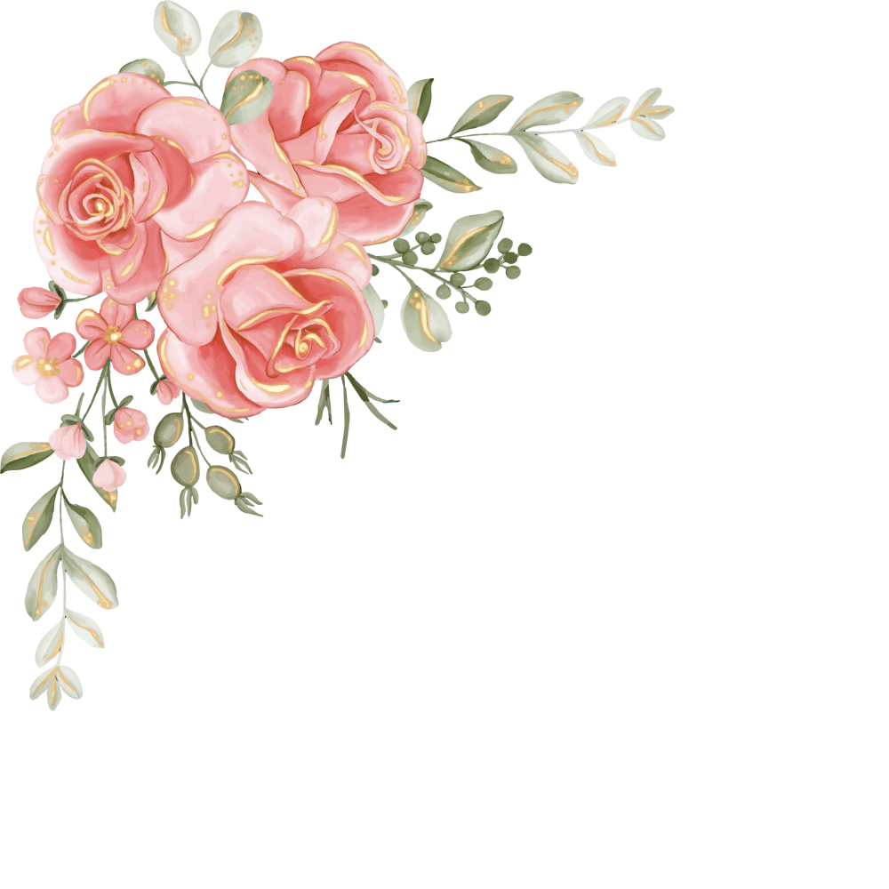

# Changelog [22/05/2026 - 17:05] - Inserção de Logo com Iniciais e Retorno de Nomes dos Padrinhos

Este changelog documenta a restauração do nome dos padrinhos convidados ("Bruna e Vitor") no título e cabeçalho, e a inserção da logo com as iniciais "L e N" (noivos) acima do subtítulo "Convite Especial".

## Prompt Motivador
"Podia deixar o Bruna e Vitor, aquele nome é dos padrinhos convidados. A logo deve ser inserida acima de 'Convite Especial'."

## Funcionamento Anterior vs. Funcionamento Atual
- **Antes:**
  - O cabeçalho e título exibiam as iniciais "L e N" no lugar do nome dos padrinhos convidados ("Bruna e Vitor").
  - Não havia logo ou iniciais separadas no topo do cabeçalho.
- **Agora:**
  - O título da página (`<title>`) e o cabeçalho (`<h1 class="names">`) exibem novamente o nome dos padrinhos convidados ("Bruna e Vitor").
  - As iniciais dos noivos "L e N" foram inseridas como um texto elegante e minimalista no topo do cabeçalho, acima de "Convite Especial", atuando como a logo oficial do casal.
  - A assinatura final no rodapé continua como "L e N" ("Com carinho, L e N"), pois são os noivos que assinam o convite.

## Backups Criados
- `index_backup_13_20260522.html` (criado antes da modificação em `index.html`)
- `styles_backup_10_20260522.css` (criado antes da modificação em `styles.css`)

## Código Antigo vs. Código Novo

### Código Antigo (Diferenças em `index.html`):
```html
    <title>Convite Especial - L e N</title>
...
        <!-- Header Section -->
        <header class="section section-relative">
            
            <h2 class="subtitle">Convite Especial</h2>
            <h1 class="names">L e N</h1>
        </header>
```

### Código Novo (Diferenças em `index.html`):
```html
    <title>Convite Especial - Bruna e Vitor</title>
...
        <!-- Header Section -->
        <header class="section section-relative">
            
            <div class="logo">L e N</div>
            <h2 class="subtitle">Convite Especial</h2>
            <h1 class="names">Bruna e Vitor</h1>
        </header>
```

### Código Novo (Diferenças em `styles.css`):
```css
.logo {
    font-family: var(--font-cursive);
    font-size: 3.2rem;
    color: var(--rose-gold-dark);
    margin-bottom: 15px;
    line-height: 1;
}
```
